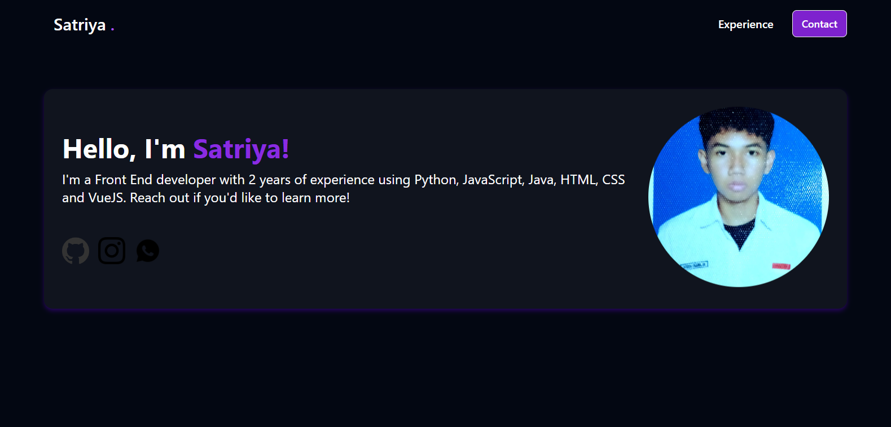
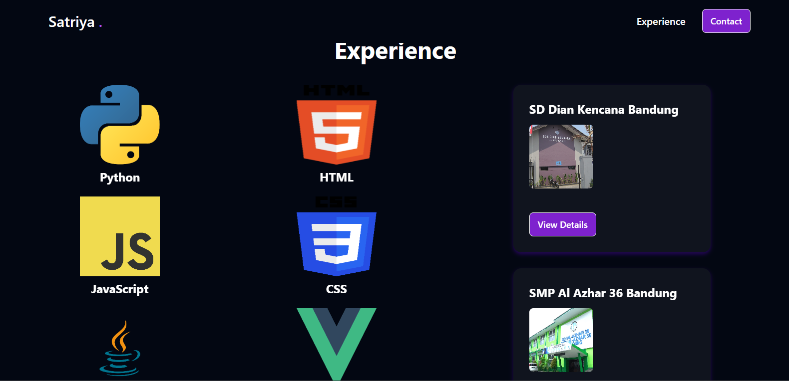
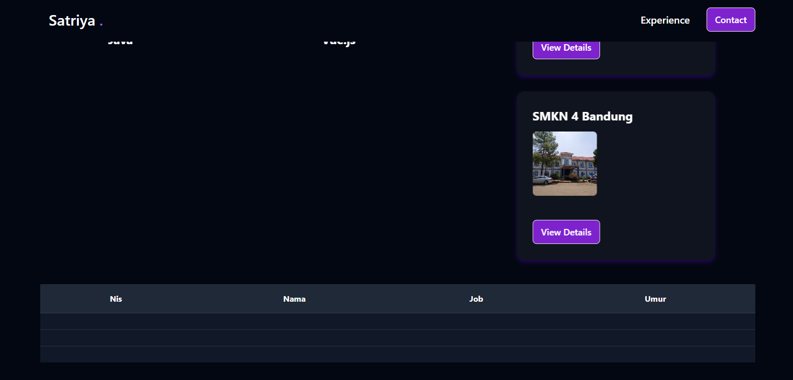

# Front end

[**Ketuk saya untuk membuka project**](#)

## Fitur-fitur:

1. **Data Profil**: Informasi lengkap mengenai profil pengguna.
2. **Skill yang Dimiliki**: Daftar keterampilan dan kemampuan yang dimiliki.
3. **Pendidikan**: Riwayat pendidikan pengguna.
4. **Daftar Pengunjung Web**: Informasi mengenai pengunjung situs web.

## Screenshot:

1. **Halaman Depan User**:
   

2. **Experience (Skill dan Pengalaman Berkependidikan)**:
   

3. **Tabel Pengunjung**:
   
